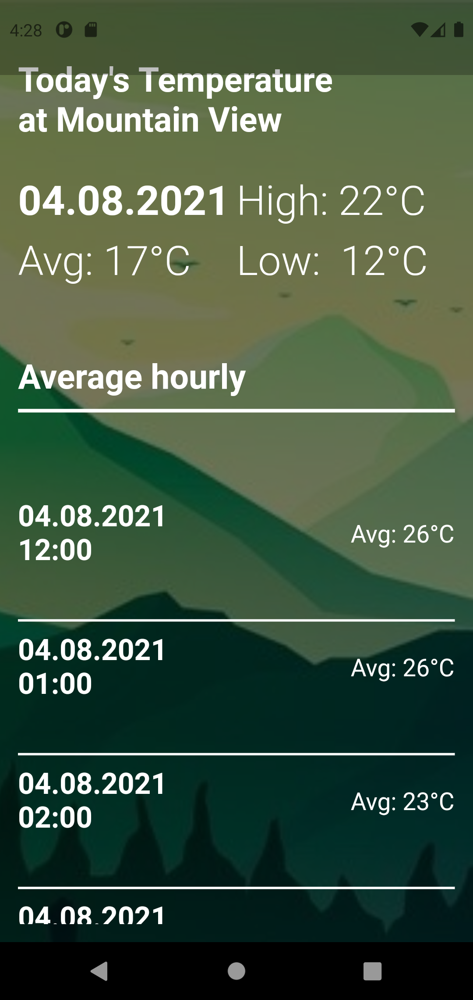
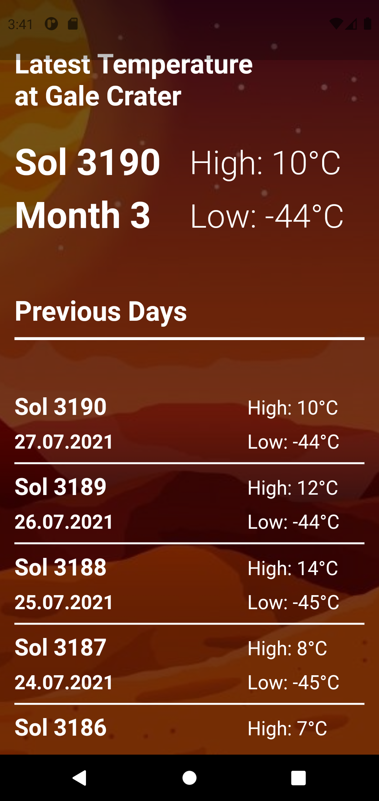

<h1 align="center"> Flutter Weather App </h1>

This project is a school project for 
Introduction to mobile technologies on University of Hradec Králové, Faculty of Informatics and Management. It was made using Flutter. 
Project contains two sections. First is weather info of GPS location on Earth. Second is weather info in Gale Crater from NASA rover Curiosity on Mars.

<h2> Earth Weather</h2>

 Latest temperature at your location. Earth Screen uses GPS sensor. Temperatures are displayed hourly in last 24h.

<h2>Mars Weather</h2>

 Latest temperature at Gale Crater. App is connected to NASA Curiosity rover API that is recieving data from NASA Curiosity rover on Mars. Temperatures are displayed by SOL.

<h2 >Final Info</h2>

Project is not under any license. You can do whatever you wish with it.

<h2>Authors</h2>

* **John Gardener** - *Whole project* - [ocasusMaximus](https://github.com/ocasusMaximus)
